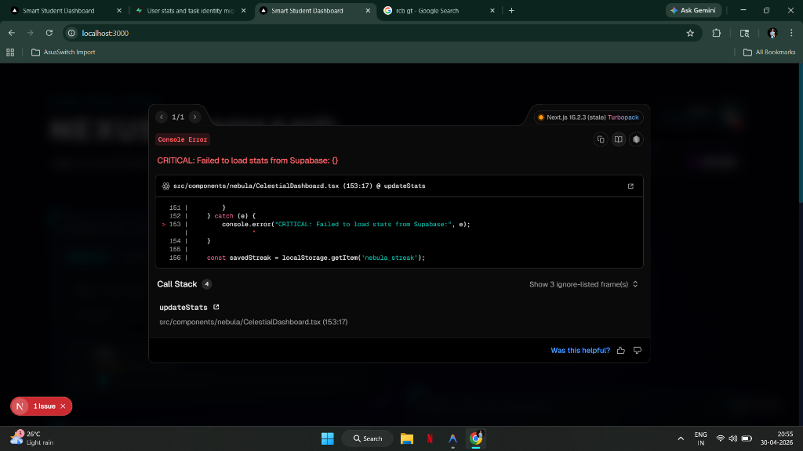
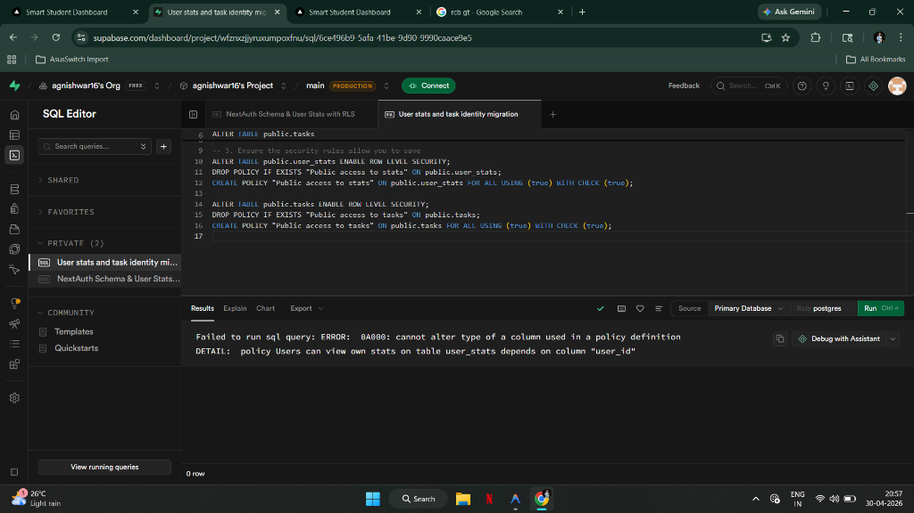
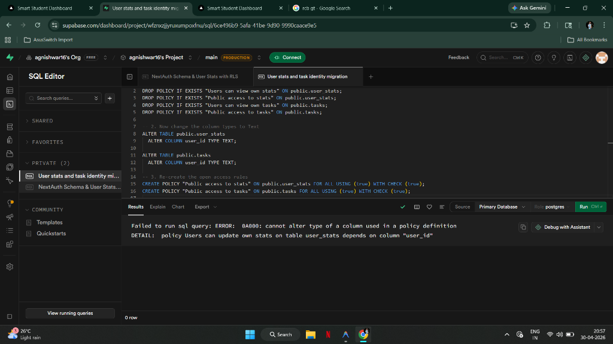

# 🌌 Nexus Command | The Intelligent Student Workspace

> **"A high-fidelity, interactive command interface for academic excellence."**

Nexus Command is a state-of-the-art productivity suite designed for students who demand a premium, immersive study environment. Built with a futuristic "Holographic" aesthetic, it combines real-time data persistence with stunning visual effects to create the ultimate focus zone.

---

## ✨ Core Features

### 🎧 Celestial Synthesizer
An immersive background audio/video engine.
- **Real-time YouTube Integration**: Seamlessly streams curated Lofi, Synthwave, and Deep Space ambient tracks.
- **Immersive Visuals**: Features a rectangle-optimized video area with holographic overlays that pulse to the beat.
- **Volume & Track Control**: Full playback control with an integrated UI.

### 📜 Temporal Rift (Tasks)
Advanced task management system linked to the cloud.
- **Gmail ID Persistence**: Your tasks are tied to your identity and stay saved no matter where you log in.
- **Priority Matrix**: Organize objectives by High, Medium, and Low priority with distinct visual indicators.
- **Dynamic Progress**: Interactive sliders to track exactly how close you are to completing a mission.

### ⚡ Neural Streak & Focus Flux
A high-performance Pomodoro timer designed for long study sessions.
- **Focus Flux**: Switch between 'Neural Sync' (Focus) and 'Recovery Uplink' (Break) modes.
- **Cloud-Synced Streaks**: Tracks your daily study consistency using a robust "Neural Streak" system.
- **Manual Sync Uplink**: A dedicated button to force-sync your progress with the Supabase cloud.

### 🧠 Neural Link (AI Assistant)
### 🧠 Agnishwar.ai (Neural Link)
A high-intelligence academic chatbot designed for deep conceptual breakdown.
- **Multi-Model Intelligence**: Seamlessly integrated with **OpenAI (GPT-4o)**, **Google Gemini 1.5 Pro**, and **Groq (Llama 3)** for ultra-fast, high-context responses.
- **Stream-Output Architecture**: Real-time token streaming for a fluid, instantaneous conversational experience.
- **Academic Contextualization**: Specializes in breaking down complex syllabi into actionable study blocks and generating dynamic schedules.
- **Markdown Mastery**: Full support for rendering complex equations, code snippets, and formatted academic notes.

### 🌀 Interactive Nebula Core
The heart of your dashboard.
- **3D Profile Interface**: An interactive, distorted 3D sphere that reacts to your mouse movements.
- **Identity Display**: Shows your command pilot status and XP progress.

---

## 🛠️ The Tech Stack

Nexus Command is built using a cutting-edge stack optimized for AI and 3D performance:

- **AI Engine**: [Vercel AI SDK](https://sdk.vercel.ai/) with multi-provider support (OpenAI, Google, Groq).
- **Frontend**: [Next.js](https://nextjs.org/) (React 19) with App Router.
- **3D Graphics**: [Three.js](https://threejs.org/) & [React Three Fiber](https://r3f.docs.pmnd.rs/getting-started/introduction).
- **Authentication**: [NextAuth.js](https://next-auth.js.org/) (Google/Gmail Login).
- **Database**: [Supabase](https://supabase.com/) (PostgreSQL & Realtime).
- **Animations**: [Framer Motion](https://www.framer.com/motion/).
- **Inference**: High-speed edge computing via Groq LPUs.

---

## 🚀 Getting Started

1.  **Clone the Mission**: `git clone https://github.com/your-username/nexus-command.git`
2.  **Initialize Systems**: `npm install`
3.  **Connect the Cloud**: Create a `.env.local` file with your Supabase and Google Auth keys.
4.  **Launch Dashboard**: `npm run dev`

---

## 🛡️ Database Setup

To enable cloud persistence, run the migrations provided in the `supabase_schema.sql` file in your Supabase SQL editor. This ensures your **Neural Streak** and **Temporal Rift** data are stored correctly for your unique Gmail ID.

---

*Designed and Developed by Agnishwar — 2026*
